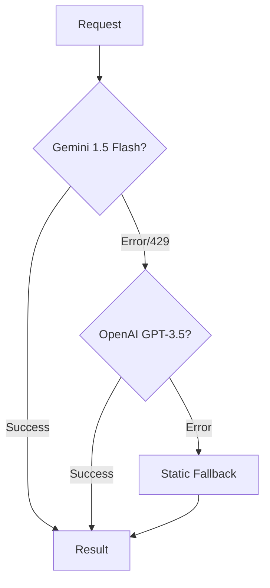

# AI Resilience Patterns

## Multi-LLM Fallback Chain
**Date:** 2026-02-17
**Context:** The application relies on AI for core features (Theming & Memes). Reliance on a single provider (Gemini Free Tier) led to service denials (429 Quota Exceeded), breaking the UI.

**Solution:**
We implemented a prioritized chain of responsibility for AI content generation:

**Implementation Details:**
- **Gemini**: Primary. Cost-effective and fast.
- **OpenAI**: Secondary. Configured via `OPENAI_API_KEY`. Only instantiated if key exists.
- **Static**: deterministic fallback (e.g., Red/Blue theme, Random 'Drake' meme) ensures the app *never* crashes due to AI unavailability.

**Key File:** `backend/src/services/AIService.js`
